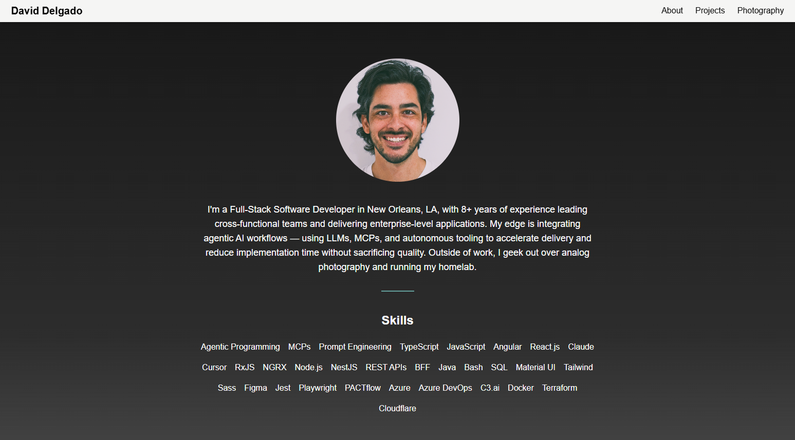

# Personal Portfolio

A modern personal portfolio website built with **React 19**, **TypeScript**, and **Vite**.

## 📸 Screenshot



## ✨ Features

- **Responsive Design** – Beautiful, mobile-friendly layout
- **Fast Performance** – Built with Vite for instant HMR and optimized production builds
- **Type-Safe** – Full TypeScript support for reliable code
- **Component Library** – Radix UI for accessible, pre-styled components
- **Tailwind CSS** – Utility-first styling for rapid development
- **GitHub Pages Deployment** – Easily deploy directly to GitHub Pages

## 🛠️ Tech Stack

- **React 19** – Latest React with improved performance and APIs
- **TypeScript** – Type-safe JavaScript development
- **Vite 5** – Next-generation frontend tooling
- **Tailwind CSS** – Utility-first CSS framework
- **Radix UI** – Unstyled, accessible components
- **React Router** – Client-side routing

## 🚀 Getting Started

### Prerequisites

- Node.js 18+ (required for Vite 5)
- npm or yarn

### Installation

```bash
npm install
```

### Development

Start the dev server with hot module replacement:

```bash
npm run dev
```

The app will be available at `http://localhost:5173`

### Building

Build for production:

```bash
npm run build
```

Output goes to the `docs` folder (configured for GitHub Pages).

### Linting & Formatting

Check code quality:

```bash
npm run lint
```

Format code:

```bash
npm run format
```

Check formatting without changes:

```bash
npm run format:check
```

### Type Checking

Run TypeScript type checking:

```bash
npm run typecheck
```

### Deployment

Deploy to GitHub Pages:

```bash
npm run deploy
```

This pushes the built `docs` folder to the `gh-pages` branch.

## 📁 Project Structure

```
src/
├── components/          # React components
│   ├── About.tsx       # About section
│   ├── Hero.tsx        # Hero section
│   ├── Navbar.tsx      # Navigation bar
│   ├── Photography.tsx # Photography gallery
│   ├── Projects.tsx    # Projects showcase
│   ├── Footer.tsx      # Footer section
│   └── ui/             # Reusable UI components
├── assets/             # Images and static files
│   └── content/        # Content data (en.json)
├── App.tsx             # Main app component
├── main.tsx            # React entry point
└── globals.css         # Global styles
```

## 🎨 Customization

### Content

Update portfolio content in `src/assets/content/en.json`

### Styling

- Global styles: `src/globals.css`
- Component styling uses Tailwind CSS utility classes
- Component variants defined with `class-variance-authority`

## 📦 Dependencies

### Production
- React 19.x & React DOM 19.x
- React Router for navigation
- Radix UI components for accessible UI
- Tailwind CSS for styling
- Lucide React for icons
- Recharts for data visualization (if needed)

### Development
- TypeScript for type safety
- Vite for build tooling
- ESLint & Prettier for code quality
- Tailwind CSS for styling

## 📝 License

This project is open source and available under the MIT License.

## 👨‍💻 Author

[Your Name/Link]

---

**Last Updated:** March 2026
**React Version:** 19.x
**Vite Version:** 5.x
